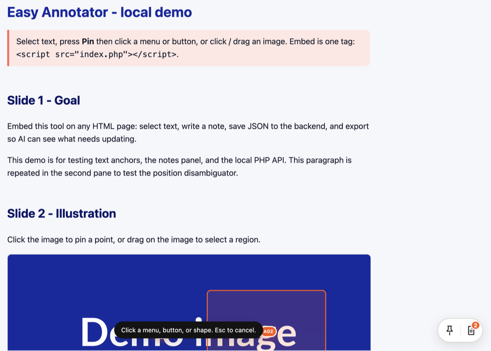
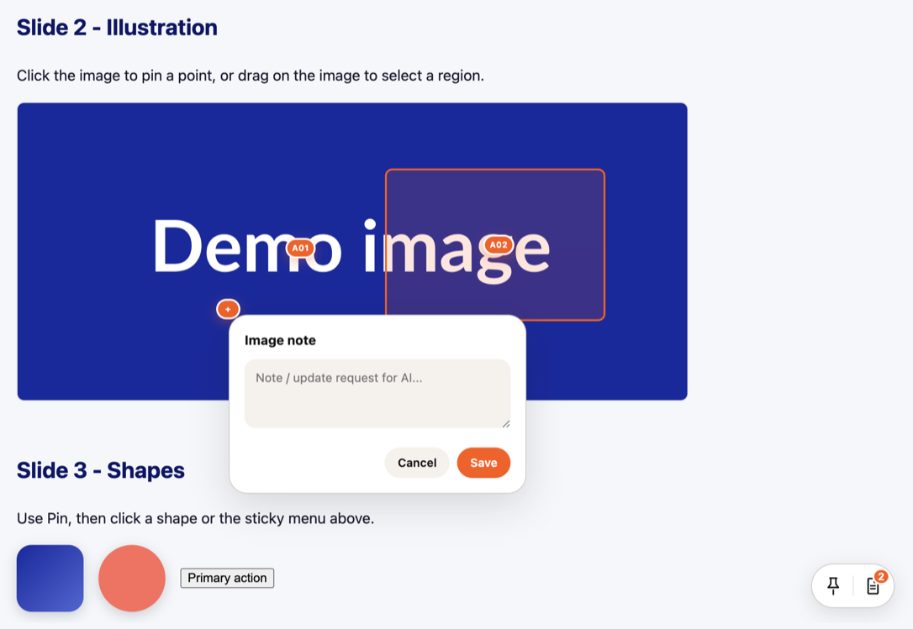
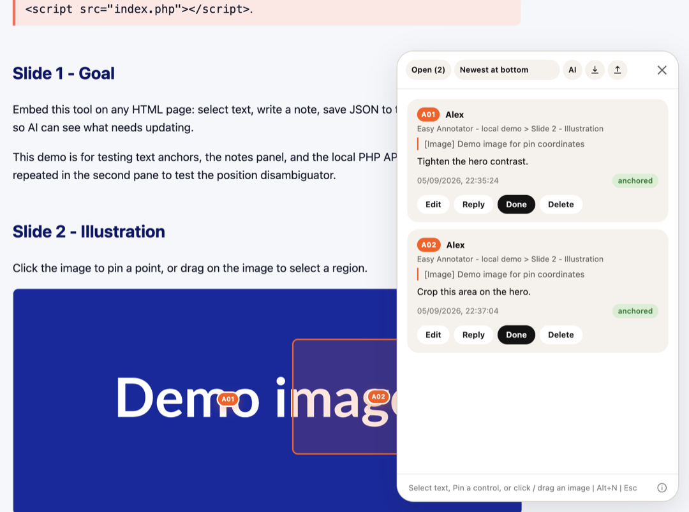

# Easy Annotator

[ENGLISH](README.md) | [VIỆT NAM](README.VN.md)

Ghi chú trên HTML: bôi chữ, ghim control, ghim ảnh, lưu JSON, AI đọc và trả lời. PHP 7.4+, không npm.

Làm bởi [Blue Coral](https://bluecoral.vn/), digital agency tại Sài Gòn. Thiết kế và phát triển website, app và eCommerce sao cho sản phẩm chạy đúng việc.

Người dùng **không gõ lệnh**. Dán một prompt dưới đây cho AI.

Repo: `https://github.com/bluecoral-vn/easy-annotator`

## Prompt có sẵn

### 1. Setup skill (repo đang viết tài liệu)

Dán, thay domain:

```
Setup Easy Annotator từ https://github.com/bluecoral-vn/easy-annotator
Domain: https://YOUR_HOST/easy-annotator
```

AI tự hỏi LLM nếu chưa rõ (gợi ý: Codex, OpenCode, Claude; nhận Cursor), copy skill đúng chỗ, ghi `{ "domain": "…" }` vào `annotator.config.json`. Không điền `api` / `script` / `pages`.

Nếu đã biết LLM, thêm một dòng: `LLM: Codex` (hoặc OpenCode / Claude / Cursor).

### 2. Trả lời comment

```
Đọc comment trên [URL chia sẻ], reply các note chưa xong. Không đánh Done.
```

Hoặc mở panel ghi chú, bấm **AI**, dán vào chat AI.

## Trông như thế nào

Bốn case trên trang đã chèn script.

**1. Bôi chữ** → nút **+ Note**


**2. Pin** → click menu, nút, hoặc shape



**3. Click ảnh** → ghim có số `A01`



**4. Panel ghi chú** (Alt+N) → list, id `A01`, nút **AI**, icon export / import



## Hai thư mục (đừng lẫn)

| Thư mục | Đưa đi đâu |
|---|---|
| `host/` | **Chỉ cái này** lên PHP hosting. Upload **nội dung** folder (file nằm ngay document root của `{domain}`). |
| `skill/easy-annotator/` | Copy vào repo tài liệu, theo LLM (bảng dưới). |

Không upload lên hosting: `skill/`, `.cursor/`, README, `AGENTS.md`, `tests/`, token.

Sau khi upload `host/`, domain ví dụ `https://x.example.com/easy-annotator` phải mở được `{domain}/index.php`.

## Chèn thủ công (không dùng AI)

```html
<script src="https://YOUR_HOST/easy-annotator/index.php"></script>
```

AI đọc `domain` từ `annotator.config.json` rồi dùng `{domain}/index.php`. Không có file `annotator.config.example.json`.

## HTML vs Markdown

| Việc | File |
|---|---|
| Người đọc, comment, share | `.html` + embed |
| README, skill, spec, ghi chú cho model | `.md` |

## Config

Commit ở root repo. Một field:

```json
{ "domain": "https://YOUR_HOST/easy-annotator" }
```

Suy ra: embed `{domain}/index.php`, API `{domain}/annotations.php`, trang `{domain}/index.php?name={slug}`.

Comment không cần token (GET + POST reply). Upload HTML vẫn dùng Bearer: `anno-data/.ai-token` cạnh file PHP trong `host/`, hoặc env `ANNOTATOR_AI_TOKEN`. File `.annotator-token` còn sót là cùng một secret, không phải vai trò thứ hai.

## Skill path

| Agent | Thư mục |
|---|---|
| Codex | `.agents/skills/easy-annotator/` |
| OpenCode | `.opencode/skills/easy-annotator/` |
| Claude | `.claude/skills/easy-annotator/` |
| Cursor | `.cursor/skills/easy-annotator/` |

Gốc trong repo này: `skill/easy-annotator/`.

## Dùng trên trang

Bôi chữ → + Note. Icon Pin → click menu, nút, hoặc shape. Click ảnh → ghim. Kéo ảnh → vùng. Alt+N panel. Esc đóng popover, rồi Pin mode, rồi panel. Nút **AI** copy prompt reply (không nhét token vào clipboard). Chỉ sửa note của mình. Resolve trên reply. AI chỉ đọc và reply. Id: `A01`…`A99`, rồi `B01`.

## Hosting (một lần)

1. Upload **nội dung** `host/` lên folder PHP public.
2. Chỉ khi AI PUT HTML: ghi `anno-data/.ai-token` (chmod 600) trên server, hoặc env `ANNOTATOR_AI_TOKEN`. Reply không dùng token này.
3. Demo local: trỏ vhost vào `host/` (xem `dev.md`).

`anno-data/` tự tạo, không public.

Cron tùy chọn (tuổi ghi trên crontab, không cấu hình trong PHP). Xóa file `anno-data/*.json` của trang mà comment mới nhất đã quá hạn. Chỉ CLI:

```
0 3 * * * php /path/to/host/cron-purge.php 90d
```

`90d` / `24h` / `30` (ngày). Không gọi file này bằng HTTP.

## Chống spam (ngắn)

Mở để comment, không captcha. Trần server: 10 ghi/IP/phút, 40 ghi/trang/phút, 8 URL mới/10 phút/IP, 200 note/trang, 4000 ký tự, JSON 256 KB. PUT note cần `X-Owner-Key`. AI reply là POST công khai (có rate limit). Upload HTML cần token AI. Honeypot trình duyệt chỉ chặn bot form. Sau Cloudflare: `ANNOTATOR_CLIENT_IP_HEADER=CF-Connecting-IP` nếu cần. Không làm trang `/setup` public.

## Gợi ý

Giữ: người không AI nhớ một thẻ script; người có AI dán prompt; hosting chỉ `host/`; review luôn HTML.

Có thể làm tiếp: deploy `host/` bằng rsync/FTP do AI chạy nếu user đưa sẵn credential; không gộp skill vào file PHP. Consumer repo không clone PHP, chỉ skill + domain.

Không thêm: tài khoản, captcha, bắt HTTPS cho embed.

## Giấy phép

[GNU GPLv3](LICENSE). Copyright (C) 2026 [Blue Coral](https://bluecoral.vn).
