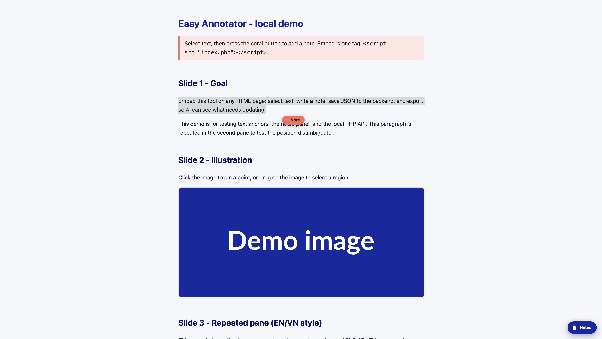
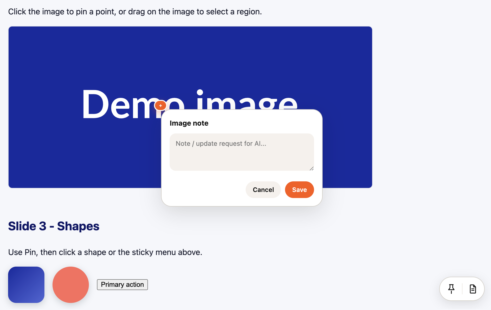
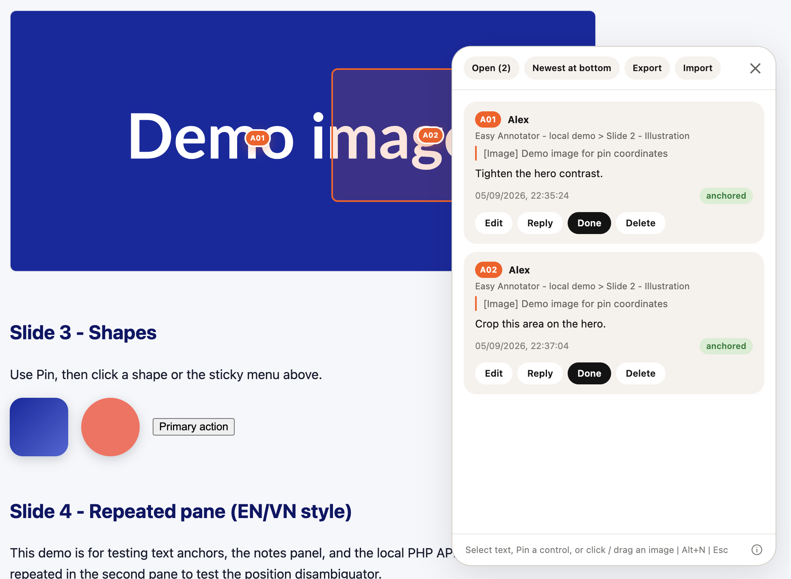

# Easy Annotator

[English](README.md) | [Tiếng Việt](README.vi.md)

Notes on HTML: select text, pin a control, pin images, save JSON, AI reads and replies. PHP 7.4+, no npm.

Made by [Blue Coral](https://bluecoral.vn/), a digital agency in Saigon. We design and build websites, apps, and eCommerce that simply work.

Users **do not type commands**. Paste a prompt below for the AI.

Repo: `https://github.com/bluecoral-vn/easy-annotator`

## Ready-made prompts

### 1. Setup the skill (in a docs repo)

Paste, then set the domain:

```
Setup Easy Annotator from https://github.com/bluecoral-vn/easy-annotator
Domain: https://YOUR_HOST/easy-annotator
```

The AI detects the coding agent if needed (Codex, OpenCode, Claude; Cursor is fine), copies the skill, writes `{ "domain": "…" }` to `annotator.config.json`, and creates a token. Do not fill `api` / `script` / `pages`.

If you already know the agent, add: `LLM: Codex` (or OpenCode / Claude / Cursor).

### 2. Reply to comments

```
Read comments on [share URL], reply to open notes. Do not mark Done.
```

## What it looks like

Four cases on a page with the embed script.

**1. Select text** → **+ Note** button



**2. Pin** (icon) → click a menu, button, or shape

**3. Click an image** → numbered pin



**4. Notes panel** (Alt+N) → list, public ids `A01`, export JSON



## Two folders (do not mix)

| Folder | Where it goes |
|---|---|
| `host/` | **Only this** to PHP hosting. Upload the **contents** (files sit at the document root of `{domain}`). |
| `skill/easy-annotator/` | Copy into the docs repo, per LLM (table below). |

Do not upload to hosting: `skill/`, `.cursor/`, README, `AGENTS.md`, `tests/`, tokens.

After upload, `{domain}/index.php` must load, e.g. `https://x.example.com/easy-annotator/index.php`.

## Manual embed (no AI)

```html
<script src="https://YOUR_HOST/easy-annotator/index.php"></script>
```

The AI reads `domain` from `annotator.config.json` and uses `{domain}/index.php`. There is no `annotator.config.example.json`.

## HTML vs Markdown

| Job | File |
|---|---|
| Humans read, comment, share | `.html` + embed |
| README, skill, spec, notes for the model | `.md` |

## Config

Committed at the repo root. One field:

```json
{ "domain": "https://YOUR_HOST/easy-annotator" }
```

Derived: embed `{domain}/index.php`, API `{domain}/annotations.php`, page `{domain}/index.php?name={slug}`.

Token (not in git): `.annotator-token` on your machine. Server: `anno-data/.ai-token` next to the PHP files in `host/`, or env `ANNOTATOR_AI_TOKEN`.

## Skill paths

| Agent | Folder |
|---|---|
| Codex | `.agents/skills/easy-annotator/` |
| OpenCode | `.opencode/skills/easy-annotator/` |
| Claude | `.claude/skills/easy-annotator/` |
| Cursor | `.cursor/skills/easy-annotator/` |

Source in this repo: `skill/easy-annotator/`.

## On the page

Select text → + Note. Pin icon → click a menu, button, or shape. Click image → pin. Drag on image → region. Alt+N panel. Esc closes the popover, then Pin mode, then the panel. Edit only your notes. Resolve on replies. AI reads and replies only. Ids: `A01`…`A99`, then `B01`.

## Hosting (once)

1. Upload the **contents** of `host/` to a public PHP folder.
2. Create a token, write `anno-data/.ai-token` (chmod 600) on the server. Setup can do this if the checkout contains `host/`.
3. Local demo: point the vhost at `host/` (see `dev.md`).

`anno-data/` is created automatically and is not public.

Optional cron (age is on the crontab, not in PHP). Deletes `anno-data/*.json` page files whose newest comment is older than the age you pass. CLI only:

```
0 3 * * * php /path/to/host/cron-purge.php 90d
```

`90d` / `24h` / `30` (days). Do not hit this file over HTTP.

## Abuse limits (short)

Open comments, no captcha. Server caps: 10 writes/IP/minute, 40 writes/page/minute, 8 new URLs/10 min/IP, 200 notes/page, 4000 characters, 256 KB JSON, PUT needs `X-Owner-Key`, HTML upload needs the AI token. The browser honeypot only stops naive form bots. Behind Cloudflare set `ANNOTATOR_CLIENT_IP_HEADER=CF-Connecting-IP` if needed. No public `/setup` page.

## Suggestions

Keep: one script tag without AI; one pasted prompt with AI; hosting is `host/` only; reviews are always HTML.

Possible next: AI rsync/FTP of `host/` if the user already has credentials. Do not fold the skill into PHP files. A consumer repo does not clone PHP, only the skill + domain.

Do not add: accounts, captcha, forcing HTTPS for embed.

## License

[GNU GPLv3](LICENSE). Copyright (C) 2026 [Blue Coral](https://bluecoral.vn).
